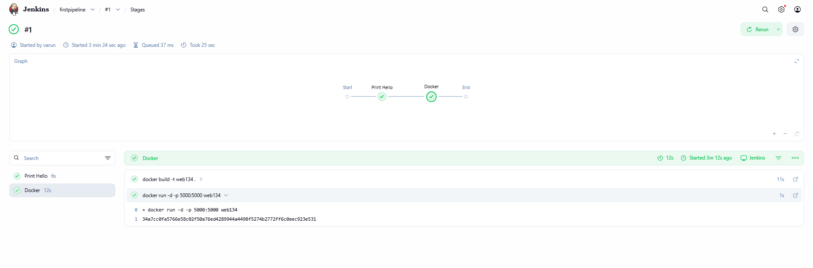
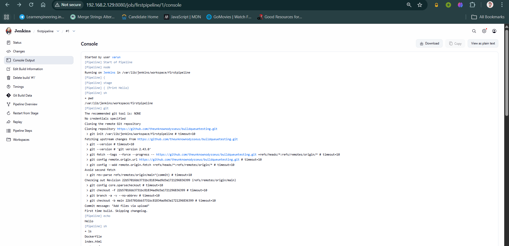
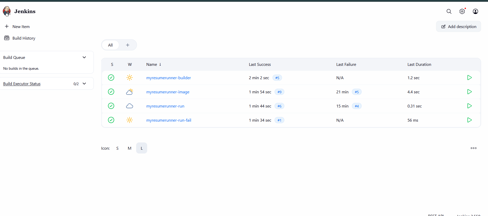
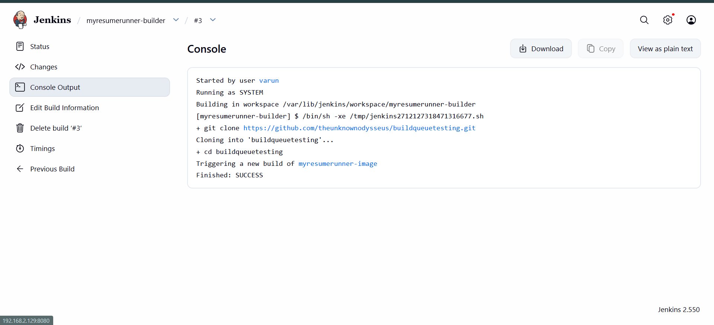
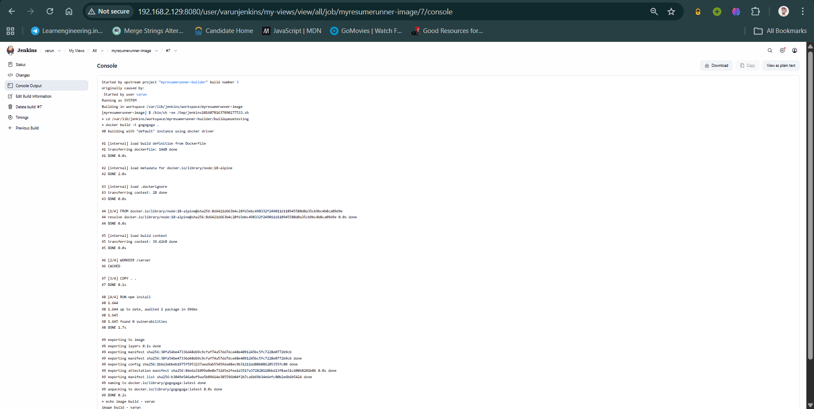
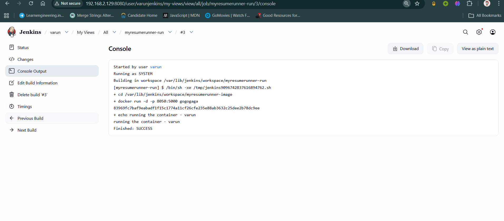
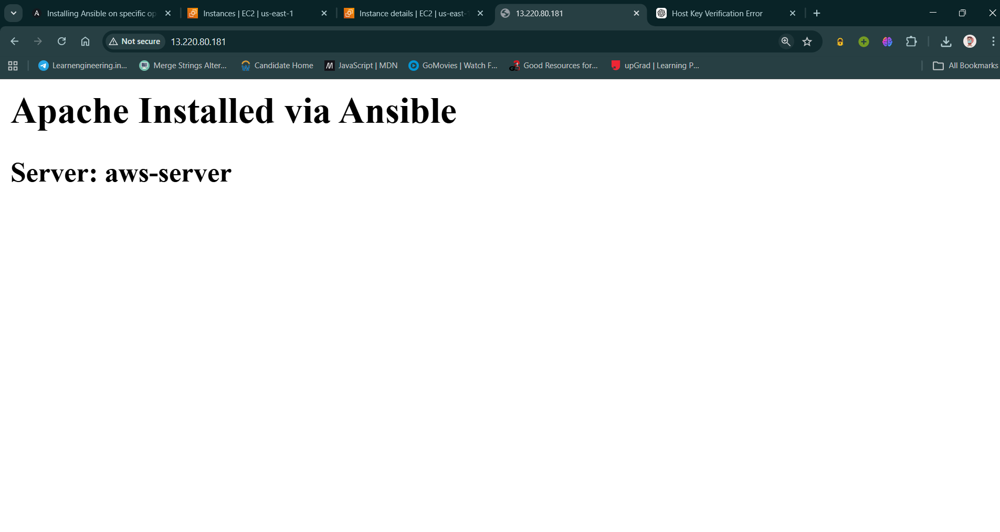
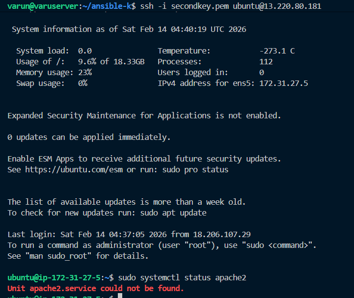

# DevOps Journey

I am writing this documentation to record my journey for learning the fundamentals of DevOps and the tools that make it possible.

## Day 1: Linux

Worked on Git and GitHub, and created a VM running in VMware. Learned how to use Linux and connected it.

### Issues Faced
- **Driver Conflicts**: Additional drivers made the VM unstable.
- **Partitioning**: Inefficient partitions caused issues.
- **Live Server**: Encountered problems with live server setups.

### Practice
- **Text Manipulation**: Created sample files (`file1.txt`, `samp.txt`) to practice basic Linux commands.

### Screenshots


---

## Day 2: Docker Fundamentals

Resolved the issues from yesterday and connected the VM's SSH to VS Code. Started working on it.

### Outcomes
- **Docker Fundamentals**: Learned how it works, why it works, and its components.
- **Basic Commands**: `ps`, `run`, `stop`, `rm`, `build`, and adding tags.

### Screenshots


---

## Day 3: Docker Deep Dive & Node.js

Installed Jenkins and learned more about Docker. Created a simple SPA using HTML, CSS, JS, and Node.js for the server. Learned about using Nginx.

### Docker Components
*(Detailed notes from `components of docker.txt`)*

- **Docker Engine**: Runs the containers. Contains:
    - `Docker daemon` (background service)
    - `Docker CLI`
- **Docker Image**: A blueprint or template. It is read-only and contains:
    - OS Layer
    - Application
    - Dependencies
    - Configuration
- **Docker Container**: A running instance of an image (Class = Image, Object = Container).
    - Example: `docker run -d -p 8080:80 nginx`
    - *Note*: Using the same ports for multiple apps creates conflicts.
- **Dockerfile**: Instructions on how to build an image.
    - `FROM`: pulls an image (use alpine for lower size)
    - `WORKDIR`: working directory
    - `COPY`: original file -> destination file
    - `CMD`: commands in a list of strings
- **Docker Registry**: Central and distributed system for images.
- **Docker Hub**: Key Image Store.

### Docker Workflow
1. Write code
2. Create Dockerfile
3. Build image
4. Push image to Docker Hub
5. Pull image on server
6. Run the container

### Key Commands Used
*(Excerpt from `commands.txt`)*
```bash
sudo apt remove docker docker-engine docker.io containerd runc -y
sudo apt install -y docker-ce docker-ce-cli containerd.io
sudo systemctl start docker
docker run hello-world
ssh-keygen -t ed25519 -C "email@example.com"
git clone git@github.com:theunknownodysseus/devops.git
docker build -t myhelloapp .
docker run -d -p 8080:3000 myhelloapp
docker ps
docker stop <container_id>
docker rm <container_id>
```

### Project: MyDocApp
Created a Node.js server to serve a resume:
- `server.js`: Simple HTTP server.
- `index.html`: Resume content.
- `Dockerfile`: Builds the app using `node:18-alpine`.

### Screenshots


---

## Day 4: Jenkins & CI/CD

Created custom Jenkins jobs and triggered jobs using other jobs. Ran a container using source code from Git via Jenkins. Used pipelines for the same workflow.

### Jenkins Insights
*(Detailed notes from `jenkins.md`)*

We usually put our code in a server online and it gets hosted and generates an IP. When code updates, we clone the whole new structure and remove the old one. If connected to hub, it automatically does this when pull is used, so the service is restarted.

**Architecture considerations**:
- Single Tier vs 2 Tier vs 3 Tier architectures.
- All this can be automated using Jenkins. Step by step every job gets executed (Builds and Pipelines).
- A app gets developed -> Tested -> Packed -> Deployment.

**Jenkins Core**:
- Main engine responsible for Web UI, Job Execution, Build Scheduling, Plugin Management, User Management.
- Can run shell commands (scripts).
- **Important**: To run a script like `./runmyresume.sh`, you must give execution permission:
  ```bash
  sudo chmod +x runmyresume.sh
  ```

### Pipelines
*(from `pipeline/pl.txt`)*

A pipeline is one job that defines multiple stages/steps executed in order (or in parallel).

**Pipeline Script**:
```groovy
pipeline{
    agent any
    stages{
        stage('Print Hello'){
            steps{
                sh 'pwd'
                git branch: 'main',url:'https://github.com/theunknownodysseus/buildqueuetesting.git'
                echo 'Hello'
                sh 'ls'
            }
        }
        stage('Docker'){
            steps{
                sh 'docker build -t web134 .'
                sh 'docker run -d -p 5000:5000 web134'
            }
        }
    }
}
```

**Possible Output**:
```text
Started by user varun
[Pipeline] Start of Pipeline
[Pipeline] node
Running on Jenkins in /var/lib/jenkins/workspace/firstpipeline
...
[Pipeline] sh
+ docker build -t web134 .
#0 building with "default" instance using docker driver
...
[Pipeline] End of Pipeline
Finished: SUCCESS
```

### Build Queue Workflow
*(from `build_queue_for_a_docker_container/flow.txt`)*

This workflow demonstrates chaining Jenkins jobs to build and run a container.

#### 1. myresumerunner-builder
A Jenkins job that pulls code from a GitHub repository and runs build steps.
**Execute Shell**:
```bash
git clone https://github.com/theunknownodysseus/buildqueuetesting.git
cd buildqueuetesting
```

#### 2. myresumerunner-image
Builds a Docker image from the code located in the workspace of the builder job. Triggered after builder success.
**Execute Shell**:
```bash
cd /var/lib/jenkins/workspace/myresumerunner-builder/buildqueuetesting
docker build -t gogogaga .
echo "image build - varun "
```

#### 3. myresumerunner-run
Runs a Docker container from the image `gogogaga`.
**Execute Shell**:
```bash
cd /var/lib/jenkins/workspace/myresumerunner-image
docker run -d -p 8050:5000 gogogaga
echo "running the container - varun"
```

### Screenshots











## Day 5: AWS and Cloud

Explored Cloud Computing concepts and AWS services.

### Key Concepts
- **Cloud Service Models**:
    - **IaaS (Infrastructure as a Service)**: Computing resources over the internet (e.g., AWS EC2).
    - **PaaS (Platform as a Service)**: Managed platforms for developing and deploying apps (e.g., AWS Elastic Beanstalk).
    - **SaaS (Software as a Service)**: Complete software solutions (e.g., Gmail, Dropbox).

### AWS Services
- **EC2 (Elastic Compute Cloud)**: Scalable virtual servers.
    - **AMI (Amazon Machine Image)**: The OS template for the instance (e.g., Amazon Linux, Ubuntu).
    - **Instance Types**: Defines vCPU and Memory resources.
    - **Key Pairs**: Secure login information (Public/Private keys, `.pem`/`.ppk`).
    - **Security Groups**: Virtual firewalls to control traffic (e.g., SSH on port 22, HTTP on port 80).
- **VPC (Virtual Private Cloud)**: Isolated network environment.
- **IAM (Identity and Access Management)**: Manage access to AWS resources.
- **S3 (Simple Storage Service)**: Scalable object storage.

### Terraform (Infrastructure as a Code)
Used Terraform to manage infrastructure programmatically.

- **Benefits**: Version controlled, reproducible, less prone to human error.
- **Core Workflow**:
    1.  `terraform init`: Initialize the working directory.
    2.  `terraform plan`: Preview changes.
    3.  `terraform apply`: Create/update resources.
    4.  `terraform destroy`: Clean up resources.

**Example `main.tf` snippet**:
```hcl
resource "aws_instance" "web" {
  ami           = "ami-12345678"
  instance_type = "t2.micro"
}
```

### Screenshots


---

## Day 6: Configuration Management & Orchestration

Focused on automating configuration and managing containerized applications.

### Ansible
Comparison of tools:
- **Docker**: Containerization.
- **Jenkins**: Automation/CI/CD.
- **Terraform**: Infrastructure Provisioning.
- **Ansible**: Configuration Management.

**Key Concepts**:
- **Architecture**: Control Node (Master) manages Managed Nodes (Slaves) via SSH. Agentless.
- **Playbook**: YAML file defining tasks to be executed.
- **Inventory**: File listing the managed nodes (IPs/Hostnames).

**Command**: `ansible-playbook -i inventory.ini playbook.yml`

### Kubernetes (K8s)
Container orchestration platform for managing multiple containers across multiple servers.

- **Role**: The "Manager" for container "Workers".
- **Key Concepts**:
    - **Pod**: Smallest unit, runs one or more containers.
    - **Deployment**: Manages Pods (Replicas, Updates, Rollbacks).
    - **Service**: Exposes Pods to the network.
- **Features**: Auto-scaling, Self-healing, Load balancing.

### Prometheus & Grafana
- **Prometheus**: Collects and stores metrics (Time Series Database).
- **Grafana**: Visualizes metrics in dashboards.

### Screenshots





