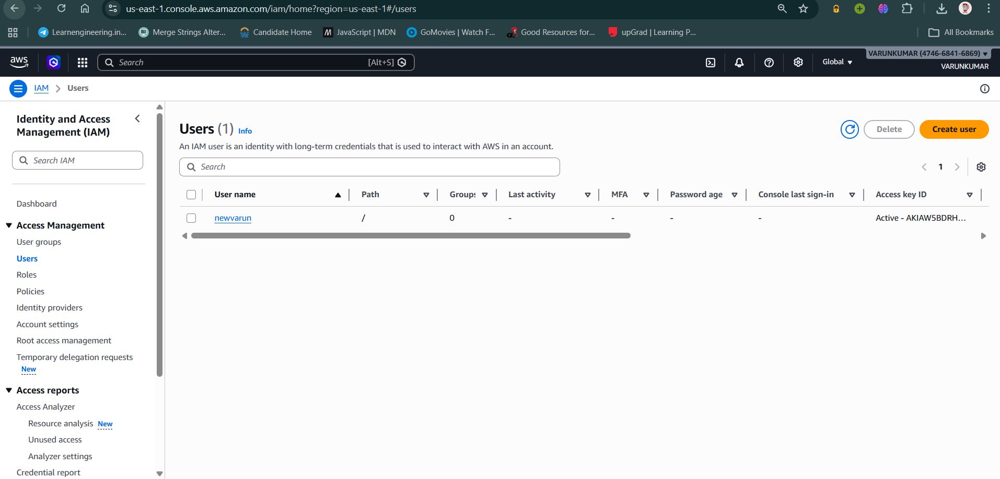
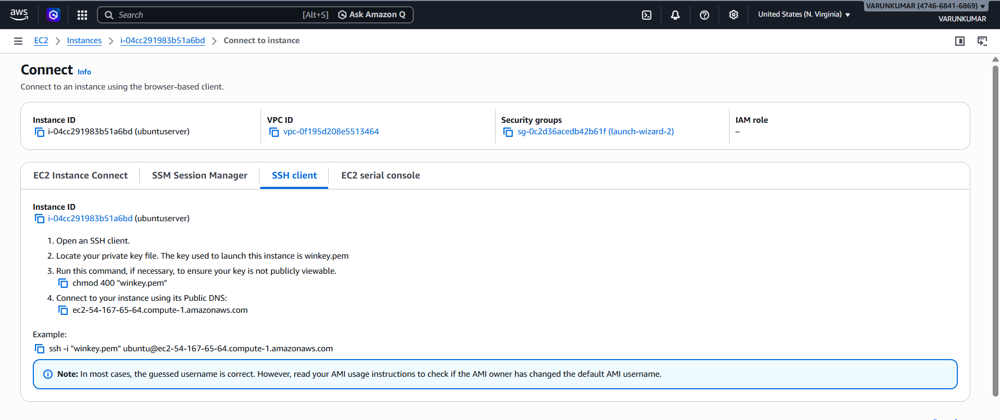
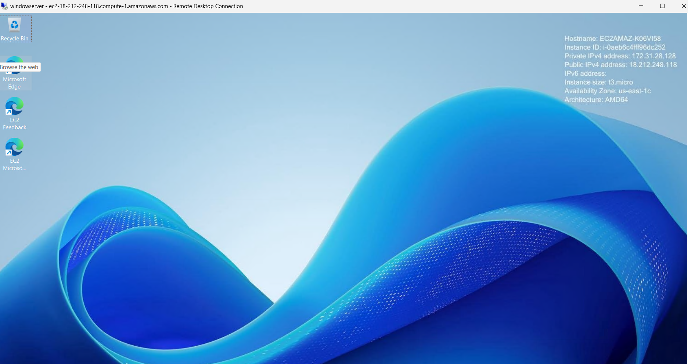
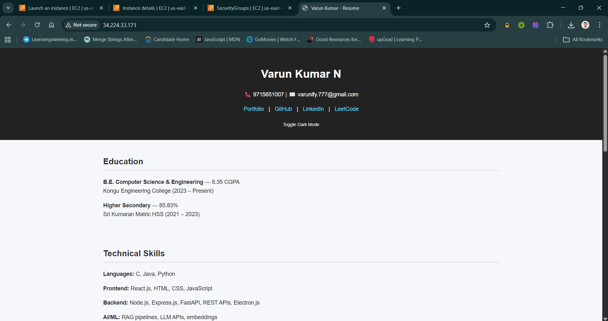
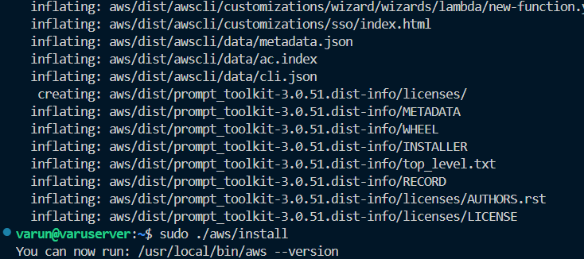

# AWS Services and Cloud Computing

## Cloud Tech
Resources and Services via internet removing the struggle of physical maintenance.

### Types of Cloud Service Models
- **IAAS (Infrastructure as a Service)**: Computing resources over internet (e.g., Server, Storage, Network).
- **PAAS (Platform as a Service)**: They maintain the machines, server's storage, dev focus only on writing the code (e.g., Security, DB).
- **SAAS (Software as a Service)**: Complete software, ready to use (e.g., Apps).

*Admin handles resources, and dev configures them.*

### SysOps
Refers to the administration, management, and maintenance of IT systems, servers, and networks, often focusing on cloud platforms like AWS.

### Region & Billing
Based on region the billings changes because the instances running in a certain location are bound to that location alone - selecting a server should be done with most care.

## Core Services

### EC2 (Elastic Compute Cloud)
Scalable cloud resources. "A machine that is running is called an instance".

- **AMI (Amazon Machine Image)**: It is the OS for the whole machine. Usually Amazon Linux (which uses RedHat), but we are using Debian (Ubuntu).
- **Instance Type**: Defines vCPU and Memory (RAM). e.g., `t2.micro`.
- **Key Pair**: AWS has the public key and we have the private key which is downloaded as a file.
    - `.pem` - Privacy Enhanced Mail
    - `.ppk` - Private PuTTY
- **Security Groups**: Virtual firewalls.
- **IOPS**: Inputs per Seconds.

### VPC (Virtual Private Cloud)
Is used in the network, you will have a separate sector in the AWS or else it wont be isolated.
*Windows VPC Example*: `vpc-0f195d208e5513464`

### IP Addressing
- **Public IP**: Changes when machine restarts.
- **Elastic IP**: A static public IP allocated to your account (used in industries).

### Other Services
- **S3**: Storage similar to Google Drive but paid.
- **IAM (Identity Access Manager)**: Manage access and permissions.

## User Data Scripts
For specifying what kind of script we are using, we use shebang:
```bash
#! /bin/bash
# commands given here are executed in the machine on startup
```

## Screenshots






