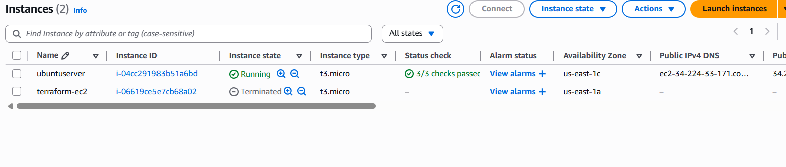
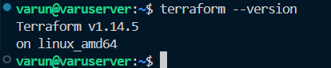
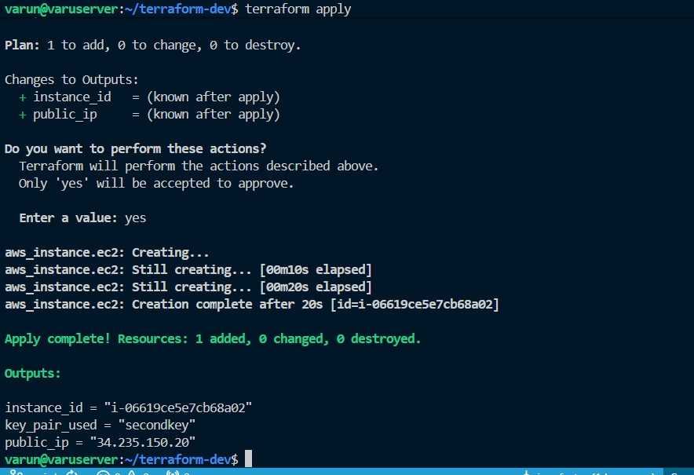

# Terraform - Infrastructure as Code (IaC)

## Introduction
We manually create server and configured the networks and do stuffs in console of aws , this is not version controlled and it is prone to human errors and this has to be done multiple times.
**IaC** means you write the infrastructure using code instead of clicking.

### Key Features
- Handle multiple clouds.
- Declarative.
- Version control friendly.
- Reusable modules.
- Execution plan before applying.

## Code Structure
Example of creating an EC2 instance:
```hcl
resource "aws_instance" "name"{
    ami = "ami-123456"
    instance_type = "t2_micro"
}
```

Using Variables (`variables.tf`):
```hcl
variable "instance_type" {
    type    = string
    default = "t2.micro"
}
```

## Architecture
- **Terraform Core**: Reads, executes and talks to providers.
- **Providers**: API plugins for AWS, Azure, Docker, etc.
- **State File**: Stores the state of the infrastructure (`terraform.tfstate`).

## Workflow Commands
1.  **`terraform init`**: Initializes the backend and provider plugins.
2.  **`terraform plan`**: Shows the execution plan (what will be created/destroyed).
3.  **`terraform apply`**: Executes the changes to create/modify infrastructure.
4.  **`terraform destroy`**: Destroys the infrastructure.

### Example Output
**Init**:
```
Initializing provider plugins...
- Finding hashicorp/aws versions matching "~> 5.0"...
- Installed hashicorp/aws v5.100.0 (signed by HashiCorp)
Terraform has been successfully initialized!
```

**Plan**:
```
Terraform will perform the following actions:
  # aws_instance.ec2 will be created
  + resource "aws_instance" "ec2" {
      + ami                          = (sensitive value)
      + instance_type                = "t2.micro"
      + key_name                     = "secondkey"
      ...
    }
Plan: 2 to add, 0 to change, 0 to destroy.
```

## Screenshots



